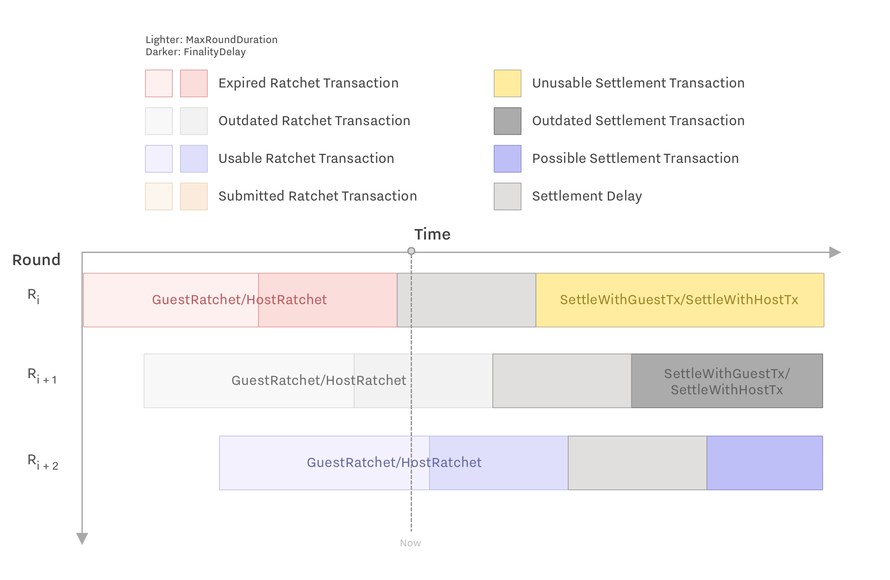
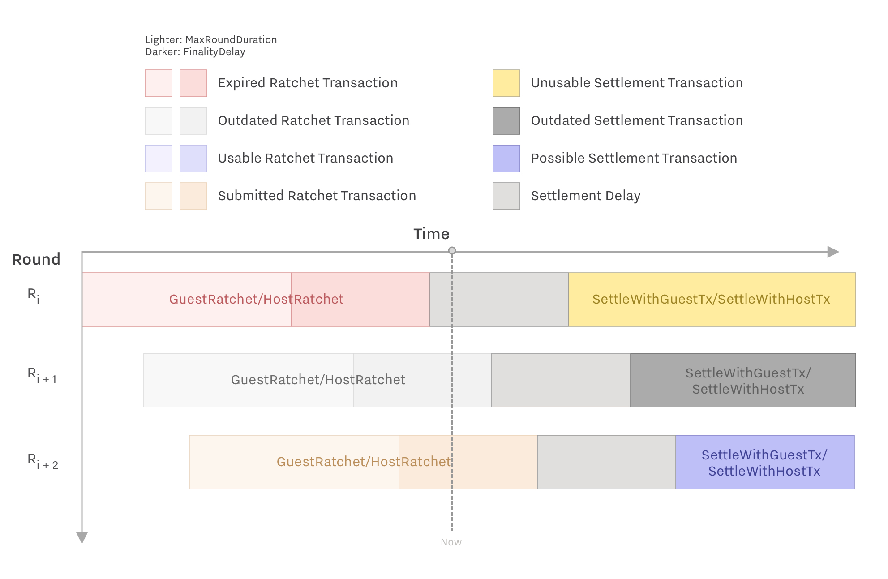
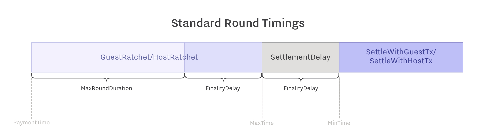
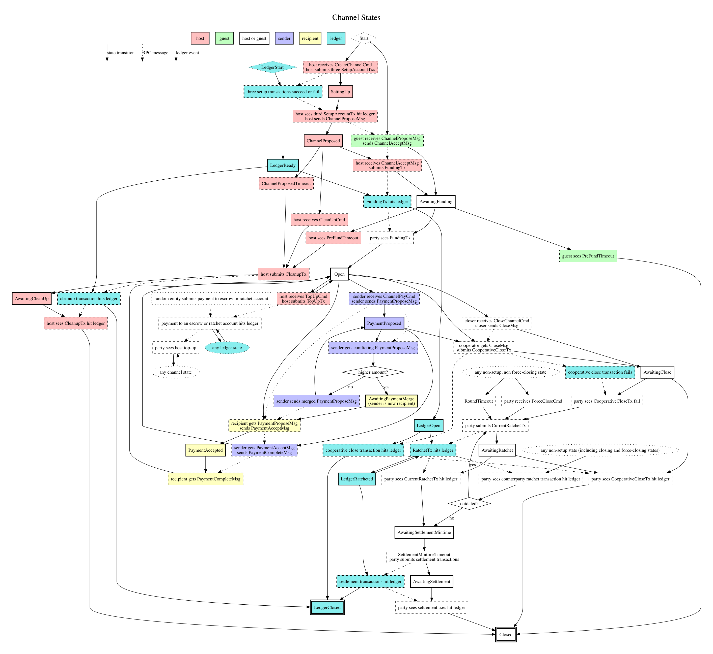

# Starlight payment-channel protocol

This document describes the Starlight payment-channel protocol for
[the Stellar network](https://www.stellar.org/).

Starlight allows two participants to transact off-network in a secure fashion.
They do so by creating an on-network “channel” that locks up the funds they intend to use.
During the lifetime of the channel,
the two parties send payments to each other privately
(i.e.,
without publishing transactions to the network)
using those funds.
When they’re finished,
they close the channel and claim their respective shares of the channel’s balance,
as determined by those intermediate payments.

The mechanism is secure against fraud and obstruction by either party,
as long as the assumptions hold true.
If one of the parties disappears or refuses to cooperate,
their counterparty will be able to withdraw their current balance from the channel,
after waiting for a delay.
Cooperating parties should be able to keep a channel open indefinitely,
and close it,
with no delay,
at any time.

This specification is for payment channels that lock up and transfer lumens,
the native currency of the Stellar network.
It generalizes,
with some minor modifications,
to payment channels in other assets issued on Stellar.

The Starlight protocol is still under active development.
Until it is stabilized,
we may make incompatible changes and upgrades to it without notice.

The Starlight protocol makes use of several built-in features and functionalities of the Stellar Protocol,
including multisignature accounts,
sequence numbers,
and mintime and maxtime constraints.
You can learn more about the relevant features of the Stellar protocol
[in the appendix](#stellar-protocol-background).

- [Starlight payment-channel protocol](#starlight-payment-channel-protocol)
  - [Starlight mechanism overview](#starlight-mechanism-overview)
  - [Creating a channel](#creating-a-channel)
  - [Payment](#payment)
  - [Host top-up](#host-top-up)
  - [Conflict resolution](#conflict-resolution)
  - [Cooperative closing](#cooperative-closing)
  - [Force closing](#force-closing)
- [Appendix](#appendix)
  - [Timing diagrams](#timing-diagrams)
  - [Channel state diagram](#channel-state-diagram)
  - [Node states](#node-states)
  - [Accounts](#accounts)
  - [Computed values](#computed-values)
  - [Messages](#messages)
  - [Transactions](#transactions)
  - [User commands](#user-commands)
  - [Timers](#timers)
  - [Fees](#fees)
  - [Timing parameters](#timing-parameters)
  - [Stellar protocol background](#stellar-protocol-background)

## Starlight mechanism overview

There are two parties in a Starlight channel:
a _Host_ and a _Guest_.
The Host is the one proposing the channel and the Guest is the one accepting it.

Both parties run a software _agent_ that executes the steps of the protocol on their behalf.
The agent must be highly available:
it has to be online to receive channel payments and must also interact with each channel periodically to protect the funds they contain.
The agent listens for commands from the user,
monitors the Stellar network for relevant transactions,
sends and receives RPC messages to and from other users’ Starlight agents,
and triggers time-based events.

For an agent to be a Guest on a channel,
its agent must have a publicly accessible URL or IP address.
Host does not need to have a publicly accessible server.
Host sends messages to Guest using HTTP `POST` requests.
To receive messages from Guest,
Host must send long-polling `GET` requests to Guest.

The Host’s agent sets up a channel by creating various Stellar accounts as described below.
The Host is also responsible for funding the channel with:

- Lumens to cover each account’s required reserve balance.
  These lumens are fully recovered by the Host when the channel closes.
- Lumens to cover fees for the on-network parts of the Starlight protocol.
  Some of these may be recovered by the Host when the channel closes.
- The balance to be used for making payments from the Host to the Guest.
  Once the Guest has received some payments in the channel,
  he or she may use their balance to make payments to the Host.

The Host has a Stellar account with a single public key.
We’ll refer to this account as `HostAccount` and the key as `HostAccountKey`.
The Guest also has a Stellar account with a single public key:
`GuestAccount` and `GuestAccountKey`.
The Guest’s account must be well-known
(i.e.,
an account that the Host is able to find).

When creating a channel,
the Host
(via his or her agent)
sends a channel-proposal protocol message to the Guest.
The Guest responds with a message accepting the channel.
(Since a channel does not require any funding from the Guest,
he or she can accept all incoming channel proposals automatically.)

The funds in the channel are held in a new
[EscrowAccount](#escrowaccount)
created for this purpose.
Funds in that account can be spent only when both parties sign a transaction.
Two other accounts,
the
[HostRatchetAccount](#hostratchetaccount)
and the
[GuestRatchetAccount](#guestratchetaccount),
are created for use with the channel but do not hold funds
(other than their required minimum balances).
Instead,
they serve as dedicated Stellar-transaction “source accounts” with predictable sequence numbers.
All three accounts are merged back to `HostAccount` when the channel closes.

Once the channel is set up,
the parties may make any number of
(private,
instant)
payments to each other using the funds in the channel.
The Host may “top up” the channel with additional funds.
Either party may decide to close the channel at any time.
Closing the channel pays each party his or her respective balance of the funds in the channel and returns reserves and unused fees to the Host.

Making a payment involves the off-ledger exchange of signed,
_unpublished_ Stellar transactions.
These transactions guarantee that if one party does not cooperate in continuing or closing the channel,
the other party can close the channel unilaterally and extract their correct balance.

In each payment round,
the parties first exchange signed _settlement transactions_ that distribute the funds in the
[EscrowAccount](#escrowaccount)
according to the respective balances in the channel.
The settlement transactions have a too-high sequence number,
however,
so they are unpublishable until `EscrowAccount`’s sequence number is raised to that level.

Next,
the parties exchange signed _ratchet transactions_.
These use the ratchet accounts to bump up the sequence number of the
[EscrowAccount](#escrowaccount)
to set up the settlement transactions.

A ratchet transaction must therefore be published before it’s possible to publish the corresponding settlement transactions.
But it’s possible for one party to publish an outdated ratchet transaction
(one from an earlier payment round),
closing the channel with outdated settlement transactions.
To combat this
(which might allow one party to extract more from the channel than they’re entitled to),
there is a gap between the maximum time of the ratchet transactions and the minimum time of the settlement transactions.
In this time interval,
it’s possible for the other party to notice the discrepancy and publish a more up-to-date ratchet transaction.
This renders the old settlement transactions unpublishable
(since `EscrowAccount`’s sequence number is now too high).

These ratchet and settlement transactions are insurance for both parties in case either becomes unavailable or declines to cooperate.
They allow one party unilaterally to close the channel,
but as described,
they involve a delay.
If,
however,
the Host and the Guest agree to close the channel,
they can sign and publish a new
[cooperative close transaction](#cooperativeclosetx)
that closes the channel without delay.

## Creating a channel

Host creates a channel by:

- Generating keypairs and choosing parameters
- Publishing a transaction to create three accounts:
  `EscrowAccount`,
  `HostAccount`,
  and `GuestAccount`
- Proposing the channel to Guest and receiving a required signature from Guest
- Publishing a funding transaction

Host’s account must have a balance sufficient to fund the payment channel to the desired level while still maintaining its own minimum balance.
In addition to the funds that Host and Guest will use for transacting with each other,
channel setup requires `5 + 10·Feerate` lumens to be locked up
(where [Feerate](#feerate) is a channel parameter):

- The minimum balance for Guest’s ratchet account
  (2 lumens,
  as there will be at most two additional signers on the account,
  and each additional signer adds a .5 lumen minimum balance);
- The minimum balance for Host’s ratchet account
  (1.5 lumen,
  as there will be at most one additional signer);
- The minimum balance for the escrow account
  (1.5 lumens,
  as there will be at most one additional signer).
- The maximum that may be required in
  [fees](#fees)
  from the escrow account
  (`8·Feerate` XLM)
  and the ratchet accounts
  (`1·Feerate` XLM each).

Host recovers the minimum balance of each account when the account is closed.

In a cooperative close,
Host should expect to recover most of the prepaid fees deposited
(all but `4·Feerate` XLM).
In a force-close,
it is possible for all of those fees to be spent.

### Generating keypairs and choosing parameters

The channel creation process begins when the Host agent receives an
[OpenChannel](#openchannel)
command from the user to create a channel with an initial Host deposit of `HostAmount` XLM.
Before this time,
the channel is considered to be in the
[Start](#start)
state.

Host begins by generating keypairs for the following three keys:

- `HostEscrowPubKey`.
  This is used during setup of the escrow account and during cooperative channel closing.
  This is also used as the `ChannelID`.
- `FirstThrowawayPubKey`.
  This is used briefly during setup of `HostRatchetAccount`,
  to provide a unique ID for that account.
- `SecondThrowawayPubKey`.
  This is used briefly during setup of `GuestRatchetAccount`,
  to provide a unique ID for that account.

Host also chooses these parameters:

- [MaxRoundDuration](#maxroundduration)
- [FinalityDelay](#finalitydelay)
- [Feerate](#fees)

### Creating channel accounts

Host first creates the three accounts needed for the channel.

Host signs and publishes three
[SetupAccountTx](#setupaccounttx)s
to the network,
with the following respective `TargetAccount`s:
[HostRatchetAccount](#hostratchetaccount),
[GuestRatchetAccount](#guestratchetaccount),
and
[EscrowAccount](#escrowaccount).
(As with all other transactions from
[HostAccount](#hostaccount),
the specific sequence numbers are left to the implementation,
but they must be in that order.
Specifically,
the sequence number on the
[SetupAccountTx](#setupaccounttx)
for the
[EscrowAccount](#escrowaccount)
must be higher than the sequence numbers on the other two transactions.)

It does not matter if these transactions succeed or fail,
since the only way they can fail is if the account they are attempting to create already exists.

Host transitions to the
[SettingUp](#settingup)
state,
waits until all three of the transactions have either succeeded or failed,
then moves on to the next step.

Host observes `EscrowAccount.SequenceNumber` and marks it down as `BaseSequenceNumber`.
Host defines `RoundNumber` as 1.

### Proposing the channel

Host defines `FundingTime` as the most recent ledger timestamp.

Host constructs and sends a
[ChannelProposeMsg](#channelproposemsg)
message to Guest,
conveying the information about the channel.

Host can send this message to Guest’s agent’s URL,
which is specified as `STARLIGHT_SERVER` in the
[stellar.toml](https://www.stellar.org/developers/guides/concepts/stellar-toml.html)
of Guest’s home domain.
Host finds Guest’s home domain from Guest’s Stellar account or
[Stellar federation address](https://www.stellar.org/developers/guides/concepts/federation.html#stellar-addresses).

Once Host has sent this message,
he moves into the
[ChannelProposed](#channelproposed)
state.

### Accepting channel

[ChannelProposeMsg](#channelproposemsg)
is the first that Guest hears about the channel.
Before this,
Guest’s channel is considered to be in the
[Start](#start)
state.

When Guest receives the
[ChannelProposeMsg](#channelproposemsg),
she validates it.
She defines `FundingTime` as `ChannelProposeMsg.FundingTime`.

Guest observes `EscrowAccount.SequenceNumber` and marks it down as `BaseSequenceNumber`.
Guest defines `RoundNumber` as 1.

Guest constructs and sends a
[ChannelAcceptMsg](#channelacceptmsg)
to Host.

Guest now moves into the
[AwaitingFunding](#awaitingfunding)
state.

### Funding the channel

When Host receives [ChannelAcceptMsg](#channelacceptmsg),
he constructs the ratchet and settlement transactions and validates the two signatures.

Host constructs
[FundingTx](#fundingtx),
signs it with the private key(s)
for `HostAccount` as well as `HostEscrowPubKey`,
`FirstThrowawayPubKey`,
and `SecondThrowawayPubKey`,
and publishes it to the network.
In addition to adding funds to `EscrowAccount`,
this transaction adds `GuestEscrowPubKey`
(which is defined to be `GuestAccountKey`)
as a co-signer on `EscrowAccount` and `GuestRatchetAccount`,
sets `HostEscrowPubKey` as the sole signer on `HostRatchetAccount` and a co-signer on `GuestRatchetAccount`,
and adds an additional minimum balance to `HostRatchetAccount` and `GuestRatchetAccount`.

After publishing this transaction,
Host moves into the
[AwaitingFunding](#awaitingfunding)
state.

Once Guest and Host see the
[FundingTx](#fundingtx)
hit the ledger,
they transition to the
[Open](#open)
state.

## Payment

This section describes how one party,
Sender
(who could be either Guest or Host),
can send a payment to the other party,
Recipient.
Sender will only attempt this when in an
[Open](#open)
state;
otherwise,
the agent will reject the user’s request to make a payment.

Sender receives a
[ChannelPayCmd](#channelpaycmd)
from the user to make a payment of `PaymentAmount` over a channel where Recipient is the counterparty.
She chooses either the most recent ledger timestamp,
or the `PaymentTime` from the most recent completed payment,
whichever is later,
as `PaymentTime`.

Sender updates `RoundNumber` to `RoundNumber + 1`.

### Proposing payment

Sender constructs and sends a
[PaymentProposeMsg](#paymentproposemsg)
to Recipient.

Sender transitions to a
[PaymentProposed](#paymentproposed)
state.

### Accepting payment

When Recipient receives
[PaymentProposeMsg](#paymentproposemsg),
they validate it.

If they are currently in a
[PaymentProposed](#paymentproposed)
state,
they need to
[resolve the conflict](#conflict-resolution).

Otherwise,
Recipient accepts the payment as described below.

Recipient increments `RoundNumber` to `RoundNumber + 1`,
and defines
`PendingPaymentAmount` as the `PaymentAmount` from the message,
and `PendingPaymentTime` as the `PaymentTime` from the message.

Recipient constructs a
[PaymentAcceptMsg](#paymentacceptmsg).

Recipient sets `CounterpartyLatestSettlementTxes` to
[PaymentSettleWithGuestTx](#paymentsettlewithguesttx)
and
[PaymentSettleWithHostTx](#paymentsettlewithhosttx),
with the counterparty’s signatures included on them.

Recipient transitions to a
[PaymentAccepted](#paymentaccepted)
state.

Recipient sends the
[PaymentAcceptMsg](#paymentacceptmsg)
to Sender.

### Completing payment

When Sender receives
[PaymentAcceptMsg](#paymentacceptmsg),
they validate it.

Sender constructs and sends a
[PaymentCompleteMsg](#paymentcompletemsg)
to Recipient.

After sending this message,
Sender considers the payment complete.

Once Recipient receives
[PaymentCompleteMsg](#paymentcompletemsg),
they validate it,
at which point they consider the payment complete.

Before switching back to the
[Open](#open)
state,
Sender and Recipient each make the following changes:

- Set `GuestBalance` to
  [NewGuestBalance](#newguestbalance).
- Set `HostBalance` to
  [NewHostBalance](#newhostbalance).
- Set `PaymentTime` to `PendingPaymentTime`.
- Set `CurrentRatchetTx` to the signed
  [SenderRatchet](#senderratchet)
  or
  [RecipientRatchet](#recipientratchet)
  (when agent is the
  [Sender](#sender)
  or
  [Recipient](#recipient),
  respectively).
- Set `CurrentSettlementTxes` and `CounterpartyLatestSettlementTxes` to the signed
  [SettleWithGuestTx](#settlewithguesttx)
  and
  [SettleWithHostTx](#settlewithhosttx)
- Recipient now considers the payment complete,
  and transitions to an
  [Open](#open)
  state.

From this point it will be possible for either party to force-close the channel using the ratchet transaction and the two presigned settlement transactions.
See
[Force closing](#force-closing),
below.

## Host top-up

This process occurs when Host receives a
[TopUpCmd](#topupcmd)
from the user.
(This version of the protocol does not support topping-up by the Guest.)

Host can top up the channel simply by sending a payment to the escrow account from his `HostAccount` account.
A transaction including any such payment is considered a
[TopUpTx](#topuptx).

Host and Guest are always watching the account for any incoming payments,
which they immediately credit to Host’s balance.

## Conflict resolution

It is possible for both parties to attempt to make payments at the same time
(i.e.,
their
[PaymentProposeMsg](#paymentproposemsg)
messages cross in mid-flight).
If that happens,
they will need to resolve that conflict before they can consider either payment finalized.

If a party,
Sender,
receives a
[PaymentProposeMsg](#paymentproposemsg)
while in a
[PaymentProposed](#paymentproposed)
state,
they compare the `PaymentAmount` of the incoming message against the one from the
[PaymentProposeMsg](#paymentproposemsg)
that they had previously sent.

If Sender’s attempted payment was higher
(or if the attempted payments were equal and Sender is the Host),
they create a “merged” payment.
They increment `RoundNumber`,
then initiate a new
[PaymentProposeMsg](#paymentproposemsg)
with a `PaymentAmount` that is the difference between their attempted payments,
and with the same `PaymentTime` as their own attempted payment.

If Sender’s attempted payment was lower,
(or if the attempted payments were equal and Sender is the Guest),
they increment `RoundNumber`,
then transition to an
[AwaitingPaymentMerge](#awaitingpaymentmerge)
state and wait for the new
[PaymentProposeMsg](#paymentproposemsg)
from their counterparty.
Once that higher payment is complete,
they consider both payments completed.

## Cooperative closing

This process occurs when either agent receives a
[CloseChannelCmd](#closechannelcmd)
from the user.

Either Guest or Host can request a cooperative close of the channel at any time.
The party requesting a close is here referred to as the Closer,
and the other party is here referred to as the Cooperator.

Closer constructs and sends a
[CloseMsg](#closemsg)
to Cooperator.

Closer then transitions to state
[AwaitingClose](#awaitingclose).

When Cooperator receives this message,
they validate it.

If the message is valid,
Cooperator constructs a
[CooperativeCloseTx](#cooperativeclosetx),
adds the signature from the message to it,
adds their own signature from their own escrow public key,
and attempts to submit it to the ledger.

Cooperator only cooperates if they are in an
[Open](#open),
[PaymentProposed](#paymentproposed),
or
[AwaitingClose](#awaitingclose)
state.
If Cooperator is in a
[PaymentProposed](#paymentproposed)
state,
they should validate `CooperativeCloseTx` with respect to their pre-payment balances.

Since all correct cooperative close transactions at any given time should be the same,
there is no need to resolve conflicts between cooperative close attempts.

## Force closing

Once a channel is funded,
each party must remain vigilant to protect their funds in the channel.

In all states other than the
[setup states](#setup-states)
and
[force closing states](#force-closing-states),
each party must watch out for either of the following conditions:

1. Their counterparty publishes a ratchet transaction from a previous round
   (i.e.,
   one that bumps `EscrowAccount`’s sequence number to a number lower than `CurrentRatchetTx` does),
   or
2. The ledger timestamp approaches `PaymentTime` + `MaxRoundDuration`
   (which is also the maxtime for the `CurrentRatchetTx`,
   minus `FinalityDelay`),
   and the counterparty has not yet cooperated to either create a new payment round or close the channel.

In the first case,
the party must act to prevent their counterparty from settling the channel at an outdated state
(most likely a state in which the counterparty had a higher balance).
In the second case,
the party must act to prevent their latest ratchet transaction from timing out,
which would mean all the money in `EscrowAccount` would become unspendable by either party.

In either of these cases
(or if the user manually requests a force close by sending a
[ForceCloseCmd](#forceclosecmd)),
an honest party can protect themselves by taking the following actions:

First,
they submit `CurrentRatchetTx`
to the ledger.
They then transition to state
[AwaitingRatchet](#awaitingratchet).
Once they see the ratchet transaction hit the ledger,
they transition to state
[AwaitingSettlementMintime](#awaitingsettlementmintime).

They then wait until the mintime of the `CurrentSettlementTxes`,
at which point they publish the `CurrentSettlementTxes` and transition to state
[AwaitingSettlement](#awaitingsettlement).

Once they see the settlement transactions hit the ledger,
they transition to state
[Closed](#closed).

### Handling later counterparty ratchet transactions

In some cases,
a party’s counterparty can have a ratchet transaction that supersedes the party’s own latest ratchet transaction.
This can occur when there is an uncompleted payment round,
such as when a party is in state
[PaymentAccepted](#paymentaccepted),
or when a force close or cooperative close was initiated while it was in that state.
Fortunately,
in all such cases,
the party does have the signed _settlement transactions_ needed to settle that higher round.

If,
at any time,
a party sees a ratchet transaction hit the ledger that bumps the ratchet _higher_ than `CurrentRatchetTx`,
they update
[CurrentSettlementTxes](#currentsettlementtxes)
to
[CounterpartyLatestSettlementTxes](#counterpartylatestsettlementtxes).
If they are in state
[AwaitingSettlement](#AwaitingSettlement),
they return to state
[AwaitingSettlementMintime](#awaitingsettlementmintime).

# Appendix

## Timing diagrams

### Open state timing

### AwaitingRatchet state timing

### Timing reference

## Channel state diagram

## Node states

This is a list of states in which one party can be at a given time,
with respect to a particular single channel.

In all states other than
[Start](#start)
and
[Closed](#closed),
the agent maintains the following additional,
immutable,
information about each channel:

1. `ChannelID`
   (the globally unique identifier for the channel;
   identical to `HostEscrowPubKey`)
2. `MaxRoundTime`
3. `FinalityDuration`
4. `CounterpartyURL`
   (the Starlight URL of the counterparty)
5. `EscrowAccount`
6. `HostRatchetAccount`
   (including account ID and a sequence number, unless the agent is still in the
   [SettingUp](#settingup)
   state and the account has not yet been created)
7. `GuestRatchetAccount`
   (including account ID and a sequence number, unless the agent is still in the
   [SettingUp](#settingup)
   state and the account has not yet been created)
8. `HostEscrowPubKey`
9. `GuestEscrowPubKey`
10. `Role`
    (whether the agent is the Host or Guest for that channel)

### Setup states

#### Start

This is the state of a channel that has not yet been created or proposed.

#### SettingUp

This is a state that the Host is in while waiting for their transactions creating the `HostRatchetAccount`,
`GuestRatchetAccount`,
and `EscrowAccount`
accounts to hit the ledger.

While in this state,
the agent maintains the following additional information:

1. `HostAmount`
2. `SetupTxs`
   (the three
   [SetupAccountTx](#setupaccounttx)s
   they are waiting on)

#### ChannelProposed

This is a state that the Host is in after sending a
[ChannelProposeMsg](#channelproposemsg),
while waiting for Guest to send a `ChannelAcceptMsg` that accepts the channel.

While in this state,
the agent maintains the following additional information:

1. `HostAmount`
2. `FundingTime`
3. `RatchetTx`
4. `SettleOnlyWithHostTx`

#### AwaitingFunding

This is a state that both parties are in while waiting for the
[FundingTx](#fundingtx)
to hit the ledger.

While in this state,
the agent maintains the following additional information:

1. `HostAmount`
2. `FundingTime`
3. `RatchetTx`
4. `SettleOnlyWithHostTx`
5. `CounterpartyRatchetSig`
6. `CounterpartySettlementSig`

#### AwaitingCleanup

This is a state that the Host is in while waiting for the
[CleanupTx](#cleanuptx)
to hit the ledger.

### Shared state

When a channel is open
(i.e.,
in an
[open state](#open-state),
a
[payment state](#payment-states),
a
[cooperative closing](#cooperative-closing-states)
state,
or a
[force closing state](#force-closing-states),
the agent tracks the following information:

- `BaseSequenceNumber`,
  the sequence number of the `EscrowAccount` upon channel opening;
- `RoundNumber`,
  the number of the current round
- `HostBalance`,
  the amount due to Host upon channel closure
- `GuestBalance`,
  the amount due to Guest upon channel closure
- `CurrentRatchetTx`,
  the
  [RatchetTx](#ratchettx)
  from the latest round,
  including the counterparty’s signature on it;
- `CurrentSettlementTxes`,
  the settlement transactions from the latest round,
  including the counterparty’s signature on them;
- `CounterpartyLatestSettlementTxes`,
  the latest settlement transactions for which the _counterparty_ has a valid ratchet transaction,
  including the counterparty’s signature on them;
- `PaymentTime`,
  the time of the latest completed payment
  (or `FundingTime` if no payment has been made).

Note:
`CurrentSettlementTxes` normally has two items,
`SettleWithHostTx` and `SettleWithGuestTx`.
When `GuestBalance` is 0,
(such as when the channel is first opened),
`CurrentSettlementTxes` has only one item,
`SettleOnlyWithHostTx`.

`CounterpartyLatestSettlementTxes` is normally the same as `CurrentSettlementTxes`.
They are different only if the party is in a
[PaymentAccepted](#paymentaccepted)
state,
or if a close was initiated while the party was in that state.
See
[Handling later counterparty ratchet transactions](#handling-later-counterparty-ratchet-transactions).

### Open state

#### Open

This is the “default” state of an open channel,
in which the channel is open,
the round has not yet timed out,
and the party is not aware of any pending payments or close attempts.

### Payment states

These states are defined with respect to the Sender
(who could be either Host or Guest)
and the Recipient
(the other party)
of a particular attempted payment.

In each of these states,
the agent needs to maintain the following information about the most recently proposed payment:

- `PendingPaymentAmount`,
  the amount of the pending payment
- `PendingPaymentTime`,
  the time of the pending payment

#### PaymentProposed

This is the state that Sender is in after sending a
[PaymentProposeMsg](#paymentproposemsg),
and while waiting for a
[PaymentAcceptMsg](#paymentacceptmsg)
from Recipient.

#### PaymentAccepted

This is the state that Recipient is in after responding to a
[PaymentProposeMsg](#paymentproposemsg)
with a
[PaymentAcceptMsg](#paymentacceptmsg),
and waiting for a
[PaymentCompleteMsg](#paymentcompletemsg).

### Conflict resolution states

#### AwaitingPaymentMerge

This is the state that a party is in if they were expecting a
[PaymentAcceptMsg](#paymentacceptmsg),
but instead received a
[PaymentProposeMsg](#paymentproposemsg)
with a higher payment amount.
During this state,
the party awaits a
[PaymentProposeMsg](#paymentproposemsg)
with a higher round.

During this state,
a party needs to maintain the following additional information:

- `MyPaymentAmount`,
  the amount of the party’s own attempted payment
- `TheirPaymentAmount`,
  the amount of the counterparty’s attempted payment

### Force closing states

#### AwaitingRatchet

This is the state that either party is in if they have published a ratchet transaction and are waiting for it to hit the ledger.

#### AwaitingSettlementMintime

This is the state that either party is in if they have successfully published their own latest ratchet transaction to the ledger,
and are waiting for the minimum time on the settlement transactions for that round to arrive.

#### AwaitingSettlement

This is the state that either party is in once they have submitted the settlement transactions and are waiting for those to hit the ledger.

#### Closed

This is the state of a channel that has been closed.

### Cooperative closing states

#### AwaitingClose

This is the state that a party is in while waiting for a
[CooperativeCloseTx](#cooperativeclosetx)
to hit the ledger.

During this time,
the party needs to maintain the following additional information:

- `CooperativeCloseTx`,
  the transaction the party is waiting on

## Accounts

Each payment channel requires three accounts on the ledger.
Additionally,
each party to a channel has a single wallet account,
which they use as the funding and destination account for all of their channels.

### EscrowAccount

This is the account that stores the money that is held in the payment channel,
and is the source account of the
[SettleOnlyWithHostTx](#settleonlywithhosttx),
[SettleWithGuestTx](#settlewithguesttx)s,
[SettleWithHostTx](#settlewithhosttx)s,
and [CooperativeCloseTx](#cooperativeclosetx).
Its master key is `HostEscrowPubKey`.
It is created by a
[SetupAccountTx](#setupaccounttx).

The
[FundingTx](#fundingtx)
adds an additional signer to this account,
`GuestEscrowPubKey`,
with weight 1.
It also sets the thresholds on the account to 2,
meaning that both the master key
(`HostEscrowPubKey`)
and `GuestEscrowPubKey` are required to sign off on any operations from that account.

The minimum balance on this account after the
[FundingTx](#fundingtx)
is 1.5 XLM,
because it has one additional signer.

### HostRatchetAccount

This is the account that is the source account for `Host`’s
[RatchetTx](#ratchettx).
Its master key is `FirstThrowawayPubKey`.
It is created by a
[SetupAccountTx](#setupaccounttx).

The
[FundingTx](#fundingtx)
adds an additional signer to this account,
`HostEscrowPubKey`,
with weight 1.
It also sets the master key weight on this account to 0,
meaning that only `HostEscrowPubKey` is allowed or required to sign off on any operations from that account.

The minimum balance on this account after the
[FundingTx](#fundingtx)
is 1.5 XLM,
because it has one additional signer,
`HostEscrowPubKey`.

### GuestRatchetAccount

This is the account that is the source account for `Guest`’s
[RatchetTx](#ratchettx).
Its master key is `SecondThrowawayPubKey`.
It is created by a
[SetupAccountTx](#setupaccounttx).

The
[FundingTx](#fundingtx)
adds two additional signers to this account,
`HostEscrowPubKey` and `GuestEscrowPubKey`,
each with weight 1,
and sets the master key weight to 0.
It also sets the thresholds on the account to 2,
meaning that both `HostEscrowPubKey` and `GuestEscrowPubKey` are required to sign off on any operations from that account.

The minimum balance on this account after the
[FundingTx](#fundingtx) is 2 XLM because it has two additional signers, `GuestEscrowPubKey` and `HostEscrowPubKey`.

### HostAccount

This account can be used by `Host` for _all_ of their payment channels
(including as their
[GuestAccount](#guestaccount)
in other channels in which they are the Guest).

This is the account that is the source account for the
[SetupAccountTx](#setupaccounttx)s,
[FundingTx](#fundingtx),
and
[TopUpTx](#topuptx)s
(if any).

This is the destination into which funds are paid in the
[SettleOnlyWithHostTx](#settleonlywithhosttx)
and
[SettleWithHostTx](#settlewithhosttx).

### GuestAccount

This account can be used by `Guest` for _all_ of their payment channels
(including as their
[HostAccount](#hostaccount)
in other channels in which they are the Host).

This is the destination into which funds are paid in the
[SettleWithGuestTx](#settlewithguesttx).

## Computed values

The following values are defined in the context of a particular payment round.

### RoundSequenceNumber

`RoundSequenceNumber` is defined as `BaseSequenceNumber + RoundNumber * 4`

### Sender

`Sender` is defined as the party that sends the
[PaymentProposeMsg](#paymentproposemsg)
and
[PaymentCompleteMsg](#paymentcompletemsg),
and normally
(except in cases of [conflict](#conflict-resolution))
is the party that receives and validates the
[PaymentAcceptMsg](#paymentacceptmsg).

### Recipient

`Recipient` is defined as the party that receives and validates the
[PaymentProposeMsg](#paymentproposemsg)
and
[PaymentCompleteMsg](#paymentcompletemsg),
and normally
(except in cases of [conflict](#conflict-resolution))
is the party that sends the
[PaymentAcceptMsg](#paymentacceptmsg).

### SenderRatchetAccount

`SenderRatchetAccount` is defined as `HostRatchetAccount` if `Sender` is the party whose role in the channel is `Host`,
and is defined as `GuestRatchetAccount` otherwise.

### RecipientRatchetAccount

`RecipientRatchetAccount` is defined as `HostRatchetAccount` if `Recipient` is the party whose role in the channel is `Host`,
and is defined as `GuestRatchetAccount` otherwise.

### SenderEscrowPubKey

`SenderEscrowPubKey` is defined as `HostEscrowPubKey` if `Sender` is the party whose role in the channel is `Host`,
and is defined as `GuestEscrowPubKey` otherwise.

### RecipientEscrowPubKey

`RecipientEscrowPubKey` is `HostEscrowPubKey` if `Recipient` is the party whose role in the channel is `Host`,
and is defined as `GuestEscrowPubKey` otherwise.

### NewGuestBalance

`NewGuestBalance` is defined as the Guest’s balance after the payment.

If `Sender` is the party whose `Role` in the channel is `Guest`,
`NewGuestBalance` is defined as `GuestBalance - PaymentAmount`,

If `Sender` is the party whose `Role` in the channel is `Host`,
`NewGuestBalance` is defined as `GuestBalance + PaymentAmount`,

### NewHostBalance

`NewHostBalance` is defined as the Host’s balance after the payment.

If `Sender` is the party whose `Role` in the channel is `Guest`,
`NewHostBalance` is defined as `HostBalance + PaymentAmount`,

If `Sender` is the party whose `Role` in the channel is `Host`,
`NewHostBalance` is defined as `HostBalance - PaymentAmount`,

### PaymentSettleWithGuestTx

If
[NewGuestBalance](#newguestbalance) is 0,
`PaymentSettleWithGuestTx` is not used.

Otherwise, `PaymentSettleWithGuestTx` is defined as a
[SettleWithGuestTx](#settlewithguesttx)
constructed with:

- `PendingPaymentTime` as `PaymentTime`
- [NewGuestBalance](#newguestbalance) as `GuestAmount`

### PaymentSettleWithHostTx

If
[NewGuestBalance](#newguestbalance) is 0,
`PaymentSettleWithHostTx` is defined as a
[SettleOnlyWithHostTx](#settleonlywithhosttx)
constructed with `PendingPaymentTime` as `PaymentTime`.

Otherwise, `PaymentSettleWithHostTx` is defined as a
[SettleWithHostTx](#settlewithhosttx)
constructed with `PendingPaymentTime` as `PaymentTime`.

### SenderRatchetTx

`SenderRatchetTx` is defined as a
[RatchetTx](#ratchettx)
constructed with:
_ [SenderRatchetAccount](#senderratchetaccount) as `SourceAccount`
_ `PendingPaymentTime` as `PaymentTime`

### RecipientRatchetTx

`RecipientRatchetTx` is defined as a
[RatchetTx](#ratchettx)
constructed with:
_ [RecipientRatchetAccount](#recipientratchetaccount) as `SourceAccount`
_ `PendingPaymentTime` as `PaymentTime`

## Messages

Every message has three top-level fields:

1. `Body`
2. `Version`
3. `MessageSignature`

The message-type-specific fields
(specified in the following sections)
go in the `Body`.

`Version` is a number, representing the protocol version.
This number will be incremented with each incompatible change to the protocol.
Later versions of the software may be able to understand messages with older version numbers,
but are not guaranteed to.
The current `Version` number is 2.

When any message is sent,
the agent sets the `Version` number to its current protocol version number.

When any message is received,
the agent looks at the `Version`.
If it is a version number that it does not support,
it ignores the message.

`MessageSignature` is how a party authenticates that the message was sent by their channel counterparty.
It is a signature on the serialized message (with the `MessageSignature` field excluded).
It should be a signature from the public key of the message's sender.
Specifically, that public key is `HostAccountKey` if the message's sender is the `Host` on that channel,
and `GuestAccountKey` if the sender is the `Guest` on that channel.

When any message is received,
before taking the message-specific validation steps described below,
the recipient looks up the channel using the `ChannelID` from the message `Body`
and looks up their counterparty's public key,
which is either `HostAccountKey` or `GuestAccountKey`,
depending on their counterparty's role in the channel.
(If the message is a
[ChannelProposeMsg](#channelproposemsg),
no channel will exist yet.
They should instead determine `HostAccountKey` from the `HostAccount` in the message itself.)
The recipient validates that `MessageSignature` is a valid signature from that public key for the message.
If it is not,
or if the message is not a
[ChannelProposeMsg](#channelproposemsg)
and the channel lookup fails,
the recipient ignores the message.

### ChannelProposeMsg

#### Fields

1. `ChannelID`(the same as `HostEscrowPubKey` and the account ID of `EscrowAccount`)
2. `GuestEscrowPubKey`
3. `HostRatchetAccount`
4. `GuestRatchetAccount`
5. `MaxRoundDuration`
6. `FinalityDelay`
7. `Feerate`
8. `HostAmount`
9. `FundingTime`
10. `HostAccount`

#### Handling

If valid,
this message causes the agent
(who is the Guest in the channel)
to look up the current sequence number for
[EscrowAccount](#escrowaccount),
and store it as `BaseSequenceNumber`.
The agent looks up the current sequence number for
[GuestRatchetAccount](#guestratchetaccount)
and
[HostRatchetAccount](#hostratchetaccount),
and stores them as `GuestRatchetAccount.SequenceNumber`
and `HostRatchetAccount.SequenceNumber`,
respectively.

The agent then constructs and sends a
[ChannelAcceptMsg](#channelacceptmsg)
and transitions the channel to an
[AwaitingFunding](#awaitingfunding)
state.

#### Validation

To validate this message,
the agent who receives it checks that the following conditions are true:

- the agent does not already have a channel with that
  [ChannelID](#channelid)
  (i.e.,
  the channel must be in a
  [Start](#start)
  state).
- the agent does not already have a channel where `HostAccount` is the counterparty.
- `GuestEscrowPubKey` is the agent’s own public key.
- There exist accounts on the ledger with account IDs:
  - `ChannelID`
  - `HostRatchetAccount`
  - `GuestRatchetAccount`.
- The values for
  `MaxRoundDuration`,
  `FinalityDelay`,
  and `Feerate`,
  are within the agent’s accepted bounds.
- `HostAmount` is greater than 0.
- The latest ledger timestamp is later than `FundingTime - MaxRoundDuration` and earlier than `FundingTime + MaxRoundDuration`.

### ChannelAcceptMsg

#### Fields

1. `ChannelID`
2. `GuestRatchetRound1Sig`
3. `GuestSettleOnlyWithHostSig`

#### Construction

This message is constructed by Guest as part of the process of
[accepting a channel](#accepting-channel).

The agent creates
two transactions:
[SettleOnlyWithHostTx](#settleonlywithhosttx)
and
RatchetRound1Tx, which is a [RatchetTx](#ratchettx) constructed with `FundingTime` as `PaymentTime`
and `HostRatchetAccount` as `SourceAccount`.
`SettleOnlyWithHostTx` returns the funds in the `EscrowAccount` and `GuestRatchetAccount` to the `Host`
(who is the only one who’s put anything in,
so far).
`RatchetTx` bumps the sequence number of the `EscrowAccount` in order to make `SettleOnlyWithHostTx` valid
(after a timeout).

Guest signs both of these transactions
(with the private key for `GuestEscrowPubKey`)
to get `GuestRatchetRound1Sig` and `GuestSettleOnlyWithHostSig`,
respectively.

#### Validation

To validate this message,
the agent who receives it checks that the following conditions are true:

- the agent has a channel with ID `ChannelID`.
- that channel is in state
  [ChannelProposed](#channelproposed).
- `GuestRatchetRound1Sig` is a valid signature on `RatchetRound1Tx`,
  where `RatchetRound1Tx` is a
  [RatchetTx](#ratchettx)
  constructed with:
  - `FundingTime` as `PaymentTime`,
  - `HostRatchetAccount` as `SourceAccount`.
- `GuestSettleOnlyWithHostSig` is a valid signature on
  [SettleOnlyWithHostTx](#settleonlywithhosttx).

#### Handling

If valid,
this message causes the agent to submit a
[FundingTx](#fundingtx)
and transition to an
[AwaitingFunding](#awaitingfunding)
state.

### PaymentProposeMsg

#### Fields

1. `ChannelID`
2. `RoundNumber`
3. `PaymentTime`
4. `PaymentAmount`
5. `SenderSettleWithGuestSig` (or empty)
6. `SenderSettleWithHostSig`

#### Construction

This message is constructed by
[Sender](#sender)
as part of the process of
[proposing a payment](#proposing-payment).

To construct this message,
Sender’s agent creates a pair of transactions,
[PaymentSettleWithGuestTx](#paymentsettlewithguesttx)
and
[PaymentSettleWithHostTx](#paymentsettlewithhosttx).
If
[NewGuestBalance](#newguestbalance)
is 0,
this is only one transaction,
which is a
[SettleOnlyWithHostTx](#settleonlywithhosttx),
in which case `SenderSettleWithGuestSig` is empty.

Sender signs the settlement transactions with the private key for
[SenderEscrowPubKey](#senderescrowpubkey)
to get `SenderSettleWithGuestSig` and `SenderSettleWithHostSig`,
respectively.

#### Validation

To validate this message,
the agent first checks that the following conditions are true:

- the agent has a channel with ID `ChannelID`.
- that channel is in state
  [Open](#open),
  [PaymentProposed](#paymentproposed),
  or
  [AwaitingPaymentMerge](#awaitingpaymentmerge).
- `PaymentAmount` is greater than 0
- `PaymentAmount` is less than the counterparty’s balance
  (`HostBalance` if counterparty is the `Host`, `GuestBalance` otherwise).

The remaining checks depend on which state the channel is in.

If the channel is in state [PaymentProposed](#paymentproposed),
the agent only checks that the `RoundNumber` in the message is equal to the `RoundNumber` in its own state.

If the channel is in state
[Open](#open) or [AwaitingPaymentMerge](#awaitingpaymentmerge),
the agent checks that the following conditions are true:

- the `RoundNumber` in the message is one higher than the `RoundNumber` in its own state.
- `PaymentTime - MaxRoundDuration` is earlier than the most recent ledger timestamp.
- `PaymentTime + MaxRoundDuration` is later than the most recent ledger timestamp.
- `PaymentTime` is later than or equal to the `PaymentTime` of the most recent completed payment.

Then, for these next checks, all of the
[computed values](#computed-values)
used are computed using the `RoundNumber` from the message,
the `PaymentAmount` from the message as `PendingPaymentAmount`,
and `PaymentTime` from the message as `PendingPaymentTime`,
rather than using any values from the channel’s own state.

- `NewGuestBalance` is greater than or equal to 0
- If `SenderSettleWithGuestSig` is empty,
  then `NewGuestBalance` is 0
- If `SenderSettleWithGuestSig` is not empty,
  then `NewGuestBalance` is greater than 0,
  and `SenderSettleWithGuestSig` is a valid signature from `SenderEscrowPubKey` on
  [PaymentSettleWithGuestTx](#paymentsettlewithguesttx)
- `SenderSettleWithHostSig` is a valid signature from `SenderEscrowPubKey` on
  [PaymentSettleWithHostTx](#paymentsettlewithhosttx).

If the channel is in state
[AwaitingPaymentMerge](#awaitingpaymentmerge),
the agent also checks that the following additional condition is true:

- `PaymentAmount` is equal to `TheirPaymentAmount - MyPaymentAmount`

#### Handling

If this message is valid,
then the next step depends on the current state of the channel.

If the channel is in an
[Open](#open)
or
[AwaitingPaymentMerge](#awaitingpaymentmerge)
state,
this message causes the agent to send a
[PaymentAcceptMsg](#paymentacceptmsg)
and transition to a
[PaymentAccepted](#paymentaccepted)
state.

If the channel is in a
[PaymentProposed](#paymentproposed)
state,
then the next step depends on whether the `PaymentAmount` in the message is lower than the `PendingAmount`,
as described in more detail in the
[conflict resolution procedure](#conflict-resolution).

If it is lower
(or the amounts are equal and the party is the Host of the channel),
this message causes the agent to send a new
[PaymentProposeMsg](#paymentproposemsg)
and update its state to reflect new proposed payment.

If it is higher,
this message causes the agent to transition to an
[AwaitingPaymentMerge](#awaitingpaymentmerge)
state,
with `MyPaymentAmount` equal to the `PendingPaymentAmount` from the previous state,
and `TheirPaymentAmount` equal to the `PaymentAmount` from the received
[PaymentProposeMsg](#paymentproposemsg).

### PaymentAcceptMsg

#### Fields

1. `ChannelID`
2. `RoundNumber`
3. `RecipientRatchetSig`
4. `RecipientSettleWithGuestSig`
5. `RecipientSettleWithHostSig`

#### Construction

This message is constructed by
[Recipient](#recipient)
as part of the process of
[accepting a payment](#accepting-payment).

The agent creates [SenderRatchetTx](#senderratchettx),
Note that this is a ratchet transaction for Recipient’s _counterparty_.

The agent signs this ratchet transaction with the private key for
[RecipientEscrowPubKey](#recipientescrowpubkey)
to get `RecipientRatchetSig`.

Recipient uses the same key to sign
[PaymentSettleWithGuestTx](#paymentsettlewithguesttx)
and
[PaymentSettleWithHostTx](#paymentsettlewithhosttx)
to get `RecipientSettleWithGuestSig` and `RecipientSettleWithHostSig`.
(If
[NewGuestBalance](#newguestbalance)
is 0,
`RecipientSettleWithGuestSig` is empty instead.)

#### Validation

To validate this message,
the agent first checks that the following conditions are true:

- the agent has a channel with ID `ChannelID`.
- that channel is in state
  [PaymentProposed](#paymentproposed).
- `RoundNumber` is equal to the `RoundNumber` in its own state
- `RecipientRatchetSig` is a valid signature from `RecipientEscrowPubKey` on
  [SenderRatchetTx](#senderratchettx)
- If
  [NewGuestBalance](#newguestbalance)
  is 0,
  `RecipientSettleWithGuestSig` is empty;
  otherwise,
  it is a valid signature from `RecipientEscrowPubKey` on
  [PaymentSettleWithGuestTx](#paymentsettlewithguesttx)
- `RecipientSettleWithHostSig` is a valid signature from `RecipientEscrowPubKey` on
  [PaymentSettleWithHostTx](#paymentsettlewithhosttx)

#### Handling

If valid,
this message causes the agent to send a
[PaymentCompleteMsg](#paymentcompletemsg)
and transition the channel to an
[Open](#open)
state.

### PaymentCompleteMsg

#### Fields

1. `ChannelID`
2. `RoundNumber`
3. `SenderRatchetSig`

#### Construction

This message is constructed by
[Sender](#recipient)
as part of the process of
[completing a payment](#completing-payment).

Sender constructs
[RecipientRatchetTx](#recipientratchettx),
and signs it with the private key for
[SenderEscrowPubKey](#senderescrowpubkey)
to get `SenderRatchetSig`.

#### Validation

To validate this message,
the agent checks that the following conditions are true:

- the agent has a channel with ID `ChannelID`.
- that channel is in state
  [PaymentProposed](#paymentproposed).
- `RoundNumber` is equal to the `RoundNumber` in its own state.
- `SenderRatchetSig` is a valid signature from `SenderEscrowPubKey` on
  [RecipientRatchetTx](#recipientratchettx).

#### Handling

When an agent receives this,
it ignores it if the channel does not exist,
or if the channel is not in a
[PaymentAccepted](#paymentaccepted)
state.

If valid,
this message causes the agent to transition the channel to an
[Open](#open)
state.

### CloseMsg

#### Fields

1. `ChannelID`
2. `CooperativeCloseSig`

#### Construction

This message is constructed as part of the process of
[cooperatively closing a channel](#cooperative-closing).

Closer constructs a
[CooperativeCloseTx](#cooperativeclosetx).

Closer signs this transaction with their own escrow private key
(either `GuestEscrowPrivKey` or `HostEscrowPrivKey`)
to get `CloserSig`.

#### Validation

To validate this message,
the agent first checks that the following conditions are true:

- the agent has a channel with ID `ChannelID`.
- that channel is in state
  [Open](#open)
  [PaymentProposed](#paymentproposed),
  or
  [AwaitingClose](#awaitingclose).
- `CooperativeCloseSig` is a valid signature on a
  [CooperativeCloseTx](#cooperativeclosetx).

#### Handling

If valid,
this message causes the agent to submit a
[CooperativeCloseTx](#cooperativeclosetx)
and transition to a
[AwaitingClose](#awaitingclose)
state.

## Transactions

As described
[below](#fees)
in greater detail,
transaction fees for transactions from the
[EscrowAccount](#escrowaccount)
and ratchet accounts
are computed using a channel-specific `Feerate`,
while transaction fees for transactions from the
[HostAccount](#hostaccount)
are left to the implementation.

The implementation is also responsible for managing sequence numbers for transactions from the
[HostAccount](#hostaccount).
If a transaction submitted from the
[HostAccount](#hostaccount)
is invalid
(likely due to some inconsistency in how the agent tracks the account’s balance or sequence numbers),
the solution is left to the implementation,
though it could attempt to address the problem with
[HostAccount](#hostaccount).

### SetupAccountTx

- Source account:
  `HostAccount`
- Sequence number:
  `HostAccount.SequenceNumber + 1`
- Operations:
  - Create account
    `TargetAccount`
    with starting balance 1 XLM

#### Handling

An agent watches for this transaction while it is in a
[SettingUp](#settingup)
state for a channel in which it is the Host.

It does not matter if this transaction succeeds or fails,
since the only way it can fail is if the account it is attempting to create already exists.

If the Host agent sees this transaction succeed or fail,
then the next step depends on the `TargetAccount` of the transaction.

If the transaction’s `TargetAccount` is not `EscrowAccount`,
the agent continues waiting.

If the transaction’s `TargetAccount` is `EscrowAccount`,
meaning it is the last of the
[SetupAccountTx](#setupaccounttx)s
for that account,
the agent
(who is the Host in the channel)
looks up the sequence number for
[EscrowAccount](#escrowaccount),
and stores it as `BaseSequenceNumber`.
It also looks up the sequence number for
[HostRatchetAccount](#hostratchetaccount)
and
[GuestRatchetAccount](#guestratchetaccount),
and stores them as `HostRatchetAccount.SequenceNumber` and `GuestRatchetAccount.SequenceNumber`,
respectively.

It then constructs and sends a
[ChannelProposeMsg](#channelproposemsg)
and transitions the channel to a
[ChannelProposed](#channelproposed)
state.

### FundingTx

- Source account:
  `HostAccount`
- Sequence number:
  `HostAccount.SequenceNumber + 1`
- Maxtime:
  `FundingTime + MaxRoundDuration + FinalityDelay`
- Operations:
  - Pay `HostAmount + .5 + 8·Feerate` XLM from `HostAccount` to `EscrowAccount`
  - Set options on `EscrowAccount`:
    - Low threshold: 2
    - Medium threshold: 2
    - High threshold: 2
    - Signer:
      - Public key: `GuestEscrowPubKey`
      - Weight: 1
  - Pay `1 + 1·Feerate` XLM from `HostAccount` to `GuestRatchetAccount`
  - Set options on `GuestRatchetAccount`:
    - Master weight: 0
    - Low threshold: 2
    - Medium threshold: 2
    - High threshold: 2
    - Signer:
      - Public key: `GuestEscrowPubKey`
      - Weight: 1
  - Set options on `GuestRatchetAccount`:
    - Signer:
      - Public key: `HostEscrowPubKey`
      - Weight: 1
  - Pay `.5 + 1·Feerate` XLM from `HostAccount` to `HostRatchetAccount`
  - Set options on `HostRatchetAccount`:
    - Master weight: 0
    - Signer:
      - Public key: `HostEscrowPubKey`
      - Weight: 1

#### Handling

An agent watches for this transaction for its channels that are in an
[AwaitingFunding](#awaitingfunding)
state.

If it sees this transaction succeed,
it transitions the channel to an
[Open](#open)
state.

If the agent’s role in that channel is
[Guest](#guest),
it does a lookup on the ledger to confirm that the sequence number of
[EscrowAccount](#escrowaccount)
is still equal to its stored `BaseSequenceNumber`,
and that the sequence number of
[GuestRatchetAccount](#guestratchetaccount)
is still the same as the one stored locally.
It also checks that the current balance of
[EscrowAccount](#escrowaccount)
is equal to or greater than `HostAmount + 1.5 + 8·Feerate` XLM.
Finally,
it checks that there are no additional signers on
[EscrowAccount](#escrowaccount)
or
[GuestAccount](#guestaccount),
other than those added by the
[FundingTx](#fundingtx).
If any of the values are different,
it transitions the channel to a
[Closed](#closed)
state.

This transaction is not expected to fail.

If an agent is attempting to submit this transaction and it becomes invalid due to its mintime expiring,
then the agent’s
[PrefundTimeout](#prefundtimeout)
will cause it to clean up the channel.
No other action is necessary with respect to that channel.
(Depending on how the implementation manages the `HostAccount`’s sequence number,
the agent may need to take some other action to ensure that later transactions can still complete,
but this is left to the implementation.)

#### CleanupTx

- Source account:
  `HostAccount`
- Sequence number:
  `HostAccount.SequenceNumber + 1`
- Operations:
  - Merge account `EscrowAccount` to `HostAccount`
  - Merge account `HostRatchet` to `HostAccount`
  - Merge account `GuestRatchet` to `HostAccount`

#### Handling

An agent watches for this transaction for its channels that are in an
[AwaitingCleanup](#awaitingcleanup)
state.

If it sees this transaction succeed,
it transitions the channel to a
[Closed](#closed)
state.

This transaction is not expected to fail.

### RatchetTx

- Source account:
  `RatchetAccount`
- Sequence number:
  `RatchetAccount.SequenceNumber + 1`
- Maxtime:
  `PaymentTime + FinalityDelay + MaxRoundDuration`
- Operations:
  - Bump sequence of `EscrowAccount` to
    [RoundSequenceNumber](#roundsequencenumber) + 1

#### Handling

##### CurrentRatchetTx

An agent watches for `CurrentRatchetTx`
(the most recent ratchet transaction where `RatchetAccount` is its own ratchet account)
for channels that are in an
[AwaitingRatchet](#awaitingratchet)
state
(meaning when it has attempted to submit `CurrentRatchetTx`).

If it sees this transaction succeed,
it transitions the channel to an
[AwaitingSettlementMintime](#awaitingsettlementmintime)
state.

This transaction is not expected to fail.
If the agent is attempting to submit this transaction
and it becomes invalid due to an expired maxtime,
this means that the
[timing assumptions](#timing-parameters)
of the channel were violated,
which means the money in the channel may be locked up permanently.
Dealing with this failure is left to the implementation.

##### From counterparty’s RatchetAccount

An agent watches for _any_ transaction of this form where `RatchetAccount` is its counterparty’s ratchet account for channels that are in _any_ state,
other than a
[setup state](#setup-states)
or
[Closed](#closed).

If it sees this transaction succeed,
it checks the new sequence number of `EscrowAccount`.
If it is lower than the sequence number to which the channel’s `CurrentRatchetTx` would bump the `EscrowAccount`’s sequence number,
the agent submits the channel’s `CurrentRatchetTx` and transitions the channel to an
[AwaitingRatchet](#awaitingratchet)
state.

### SettleOnlyWithHostTx

- Source account:
  `EscrowAccount`
- Sequence number:
  [RoundSequenceNumber](#roundsequencenumber) + 2
- Fees:
  `3·Feerate`
- Mintime:
  `FundingTime + 2·FinalityDelay + MaxRoundDuration`
- Operations:
  - Merge account `EscrowAccount` to `HostAccount`
  - Merge account `GuestRatchetAccount` to `HostAccount`
  - Merge account `HostRatchetAccount` to `HostAccount`

#### Handling

An agent watches for any transaction of this form for channels that are in an
[AwaitingSettlement](#awaitingsettlement)
state.

If it sees this transaction succeed or fail,
it moves the channel to a
[Closed](#closed)
state.

### SettleWithGuestTx

- Source account:
  `Escrow`
- Sequence number:
  [RoundSequenceNumber](#roundsequencenumber) + 2
- Mintime:
  `PaymentTime + 2·FinalityDelay + MaxRoundDuration`
- Operations:
  - Pay `GuestAmount` from `EscrowAccount` to `GuestAccount`

#### Handling

An agent watches for any transaction of this form for channels that are in an
[AwaitingSettlement](#awaitingsettlement)
state.

If it sees this transaction succeed or fail,
it stays in an
[AwaitingSettlement](#awaitingsettlement)
state until the
[SettleWithHostTx](#settlewithhosttx)
is published.

### SettleWithHostTx

- Source account:
  `Escrow`
- Sequence number:
  [RoundSequenceNumber](#roundsequencenumber) + 3
- Mintime:
  `PaymentTime + 2·FinalityDelay + MaxRoundDuration`
- Operations:
  - Merge account `EscrowAccount` to `HostAccount`
  - Merge account `GuestRatchetAccount` to `HostAccount`
  - Merge account `HostRatchetAccount` to `HostAccount`

#### Handling

An agent watches for any transaction of this form for channels that are in an
[AwaitingSettlement](#awaitingsettlement)
state.

If it sees this transaction succeed or fail,
it moves the channel to a
[Closed](#closed)
state.

### CooperativeCloseTx

If `GuestAmount` is equal to 0, the first operation is skipped.

- Source account:
  `EscrowAccount`
- Sequence number:
  `EscrowAccount.SequenceNumber + 1`
- Fees:
  `4·Feerate`
- Operations:
  - Pay `GuestAmount` from `EscrowAccount` to `GuestAccount`
    (only if `GuestAmount` is greater than 0)
  - Merge account `EscrowAccount` to `HostAccount`
  - Merge account `GuestRatchetAccount` to `HostAccount`
  - Merge account `HostRatchetAccount` to `HostAccount`

#### Handling

An agent watches for any transaction of this form for channels that are in an
[AwaitingClose](#awaitingclose)
or
[AwaitingRatchet](#awaitingratchet)
state.

If it sees this transaction succeed,
it moves the channel to a
[Closed](#closed)
state.

If it is attempting to submit this transaction and sees it fail
(presumably due to either `GuestAccount` or `HostAccount` having been deleted),
it attempts to submit `CurrentRatchetTx` and transitions the channel to an
[AwaitingRatchet](#awaitingratchet)
state.

If this transaction becomes invalid due to too low a sequence number,
it means that one or both parties has submitted a ratchet transaction.
No further action with respect to the channel is necessary.

### TopUpTx

- Source account: `HostAccount`
- Sequence number: `HostAccount.SequenceNumber + 1`
- Operations:
  - Pay `TopUpAmount` from `HostAmount` to `EscrowAccount`

#### Handling

An agent watches for _any_ transaction that makes a payment into `EscrowAccount` for channels that are in any state other than
[Start](#start)
or
[Closed](#closed).

If it sees such a transaction succeed,
it increments `HostAmount` by `TopUpAmount`.

If it sees such a transaction fail,
the most likely reason is that the channel was closed
(probably cooperatively)
before the transaction was successfully submitted.
This does not require any action with respect to that channel.

## User commands

This is a list of the RPC commands that the user can send to the agent.

### CreateChannelCmd

This initiates an attempted
[channel creation](#creating-a-channel)
with a specified counterparty.

#### Fields

1. `Counterparty`,
   the counterparty’s Stellar account or
   [Stellar federation address](https://www.stellar.org/developers/guides/concepts/federation.html#stellar-addresses)
2. `MaxRoundDuration`
3. `FinalityDelay`
4. `HostAmount`

#### Handling

This command fails if the party already has a channel
(or pending channel)
with the specified counterparty
(i.e.,
if the channel is not in a
[Start](#start)
state).

If valid,
this command causes the agent to submit three
[SetupAccountTx](#setupaccounttx)s,
and transitions the channel into a
[SettingUp](#settingup)
state.

### ChannelPayCmd

This initiates an off-ledger payment using one of the user’s channels.

#### Fields

1. `ChannelID`
2. `Amount`

#### Handling

This command fails if the channel does not exist,
if that channel is not in an
[Open](#open)
state,
or if `Amount` is higher than the party’s balance in that channel.

If valid,
this command causes the agent to send a
[PaymentProposeMsg](#paymentproposemsg)
and transitions the channel into a
[PaymentProposed](#paymentproposed)
state.

### TopUpCmd

This initiates a top-up from the user’s wallet to one of their channels in which they are the Host.

#### Fields

1. `ChannelID`
2. `Amount`

#### Handling

This command fails if the channel does not exist,
if the user is not the Host of the specified channel,
or if that channel is not in an
[Open](#open)
state.

If valid,
this command causes the channel to return to an
[Open](#open)
state.

### CloseChannelCmd

This initiates an attempted cooperative close of one of the user’s channels.

#### Fields

1. `ChannelID`

#### Handling

This command fails if the channel does not exist,
or if that channel is not in an
[Open](#open)
state.

If valid,
this command causes the agent to send a
[CloseMsg](#closemsg),
and transition the channel into an
[AwaitingClose](#awaitingclose)
state.

### ForceCloseCmd

This initiates an attempted force close of one of the user’s channels.

#### Fields

1. `ChannelID`

#### Handling

This command fails if the channel does not exist,
or if the channel is already in any
[force closing](#force-closing-states)
state.

If valid,
this command causes the agent to submit a
[ratchettx](#ratchettx)
and transition into an
[AwaitingRatchet](#awaitingratchet)
state.

### CleanUpCmd

This initiates an attempted cleanup of one of a user’s channels in which they are the Host,
and which they have proposed to a counterparty,
but for which the counterparty has not yet responded.

#### Fields

1. `ChannelID`

#### Handling

This command fails if the pending channel does not exist,
or if the channel is not in a
[ChannelProposed](#channelproposed)
state.

If valid,
this causes the agent to submit a
[CleanupTx](#cleanuptx)
and transition into an
[AwaitingCleanup](#awaitingcleanup)
state.

## Timers

This is a list of the timers that an agent must watch out for.

When an agent is watching for a particular timer to expire,
it is watching for the _ledger_ time to pass that timer,
rather than watching its own system time.

An agent will only have one timer pending for each of its channels at any one time.

### PreFundTimeout

When a channel is in an
[AwaitingFunding](#awaitingfunding)
state,
the agent has a timer that expires at `FundingTime + MaxRoundDuration + FinalityDelay`.

When that timer expires,
the next step depends on whether the agent is the `Host` or `Guest` in that channel.

If the agent is the `Guest`,
it transitions the channel to a
[Closed](#closed)
state.

If the agent is the `Host`,
it submits the
[CleanUpTx](#cleanuptx)
and transitions the channel to an
[AwaitingCleanup](#awaitingcleanup)
state.

### ChannelProposedTimeout

When a `Host` channel is in a
[ChannelProposed](#channelproposed)
state,
the agent has a timer that expires at `FundingTime + MaxRoundDuration`.

When that timer expires,
the agent submits the
[CleanUpTx](#cleanuptx)
and transitions the channel to an
[AwaitingCleanup](#awaitingcleanup)
state.

### RoundTimeout

When a channel is in an
[open](#open-state),
[payment](#payment-states),
or
[cooperative closing](#cooperative-closing-states)
state,
the agent has a timer that expires at `PaymentTime + MaxRoundDuration`.

When that timer expires,
the agent submits the `CurrentRatchetTx` and transitions the channel to an
[AwaitingRatchet](#awaitingratchet)
state.

### SettlementMintimeTimeout

When a channel is in an
[AwaitingSettlementMintime](#awaitingsettlementmintime)
state,
the agent has a timer that expires at the mintime of the `CurrentSettlementTxes`.

When that timer expires,
the agent submits the `CurrentSettlementTxes` and transitions the channel to an
[AwaitingSettlement](#awaitingsettlement)
state.

## Fees

Transaction fees are specified in the header of each transaction.
The protocol computes them by multiplying a defined feerate by the number of operations in the transaction.

The feerate used in transactions from the
[HostAccount](#hostaccount)
is left up to the implementation.
If these transactions are delayed,
it does not threaten the safety or liveness of an open channel
(though it may delay a top-up,
or prevent a channel from being created in time.)
(There are no transactions from the
[GuestAccount](#guestaccount)
in the protocol.)

For transactions from the
[EscrowAccount](#escrowaccount),
[HostRatchetAccount](#hostratchetaccount),
and
[GuestRatchetAccount](#guestratchetaccount),
the feerate used depends on the channel,
which is parameterized with a `Feerate` value.

This feerate should be set higher than the minimum feerate,
because it is critical that ratchet transactions be included within a certain period of time,
to protect the safety of funds in the channel.
Future Stellar protocol changes such as
[this](https://github.com/stellar/stellar-protocol/issues/133)
should make it possible to safely set even higher feerates for these transactions.

Each ratchet account has an extra starting balance of `1·Feerate` XLM to pay for the fees on the
[RatchetTx](#ratchettx)
from that account,
if it is needed.

Each escrow account has an extra starting balance of `8·Feerate` XLM to pay for the
[CooperativeCloseTx](#cooperativeclosetx)
(which has four operations),
[SettleWithGuestTx](#settlewithguesttx)
(which has one operation),
and
[SettleWithHostTx](#settlewithhosttx)
(which has three operations)
from that account,
since in the worst case,
it is possible for all three to occur from the same account
(if a cooperative close transaction fails due to `HostAccount` or `GuestAccount` being deleted).

## Timing parameters

These are timing parameters that are set on a per-channel basis.
There is a tradeoff to selecting these parameters—
if they are set too low,
the liveness and
(in the case of
[FinalityDelay](#finalitydelay))
safety of the channel could be put at risk.
If they are set unnecessarily high,
then a party may be forced to wait unnecessarily long to exit their lumens from the channel.

### MaxRoundDuration

This is a parameter chosen by Host when he proposes the channel.
Guest should ignore the channel proposal if this parameter is higher or lower than the bounds considered acceptable by Guest.

This parameter,
informally speaking,
specifies how frequently Host and Guest must interact to keep a channel open
(i.e.,
to produce new ratchet transactions before the latest ones expire).

More precisely,
this parameter should be set sufficiently high that if one party initiates a payment round `R` when its view of the ledger timestamp is `T`,
then the parties will be able to complete the _next_ round, `R + 1`,
before the ledger timestamp is greater than `T + MaxRoundDuration`.

Unlike
[FinalityDelay](#finalitydelay),
if this parameter is set to too low a value,
it does not threaten the safety of the channel
(only its liveness).

### FinalityDelay

This is a parameter chosen by Host when he proposes the channel.
Guest should ignore the channel proposal if this parameter is higher or lower than the bounds considered acceptable by Guest.

This parameter should be chosen so that both parties are confident that,
if an event
occurs on the ledger at time `T`,
then that party will be able to observe that it occurred,
submit a transaction,
and have that transaction included on the ledger before time `T + FinalityDelay`.

The event could be either a transaction being included,
or the ledger timestamp itself passing time `T`.

The party can assume that the transaction they are submitting has a feerate of
the
[Feerate](#feerate)
for that channel.
They can also assume that the transaction they are submitting is valid for the entire period of `T` to `T + FinalityDelay`.

## Stellar protocol background

This is a brief overview of the Stellar features used by the Starlight payment channel protocol.
For more information on how Stellar works, you can see the
[Stellar Development Guides](#https://www.stellar.org/developers/guides/).

### Stellar accounts

The Stellar network tracks the state of individual “accounts,”
each of which can store some balance of lumens,
the Stellar network’s native currency.
(These accounts can also store balances of other issued assets on Stellar,
though this capability is not used in this specification,
which only covers payment channels that use lumens.)
Each account starts out with a single public-key _signer_,
known as a “master key,”
and has a minimum balance of 1 lumen.
This master key is also used as the account ID.

Transactions can add additional signers to an account,
which gives those signers partial control of the account.
(Stellar supports types of signers other than just public keys,
but they are not used in this protocol.)
With each additional signer,
the minimum balance requirement on the account is increased by 0.5 lumens.

Each signer
(including the master key)
has a “weight.”
For a transaction or operation from an account
(see below)
to be authorized,
it must be signed by a set of signers whose total weight is greater than the relevant threshold on the account.
(Stellar accounts have low,
medium,
and high thresholds,
corresponding to different tiers of operations,
though in this protocol,
we will ignore the differences between these thresholds,
and keep them at the same values at all times.)

Each account also has a _sequence number_.
The initial sequence number of an account is a large number that is unpredictable before the account is created.
The sequence number is incremented by each transaction from that account.

### Stellar transactions

A Stellar transaction has a single _source account_.
That account is the account responsible for paying the fees on the account.

The transaction also increments the source account’s sequence number.
Specifically, the transaction itself has a sequence number.
Sequence numbers are used to prevent replaying transactions,
and also play an important role in the Starlight protocol.

A Stellar transaction can have a _maxtime_ and/or a _mintime_,
which determine the time bounds for when it can be included on the ledger.

### Stellar operations

Each transaction includes one or more operations.
Each operation has its own source account,
which can be different from the source account of the transaction itself.

A transaction must be authorized by the source account of each of its operations,
as well as the source account of the transaction itself.

The following Stellar operations are used in the Starlight payment channel protocol.
(“Source account” here refers to the source account of the operation,
which is not necessarily the source account of the transaction.)

- `CreateAccount`:
  create an account with a particular account ID,
  funded by a starting balance of lumens
  from the source account.
  This operation fails if the destination account already exists,
  if the starting balance is less than 1,
  or if the source account does not have sufficient lumens to make the payment without going below its own minimum balance.
- `Payment`
  make a payment of an asset
  (for our purposes,
  always lumens)
  from the source account to some destination account.
  This operation fails if the destination account does not exist,
  or if the source account does not have sufficient funds to make the payment without going below its own minimum balance.
- `BumpSequnce`: bump the sequence number of the source account to some higher number.
  This operation fails if the target sequence number is higher than the current maximum allowable sequence number
  (a very large number which,
  in practice,
  our protocol puts us at no risk of hitting).
- `SetOptions`: add or remove a signer from, or change the threshold on, the source account.
  This operation fails if it would increase the minimum balance on the account higher than its current balance.
- `AccountMerge`: delete an account,
  sending all of its lumens to some destination account.
  This operation fails if the destination account does not exist.

### Stellar transaction failure

There are two ways that a transaction can fail.
(This apparently technical detail has significant implications for the Starlight protocol.)

If a transaction is not signed by all necessary signers,
the source account has insufficient balance to pay the fees,
the source account’s sequence number is incorrect,
or the current time is outside the mintime and maxtime bounds of the transaction,
the transaction is _invalid_,
and is not included on the ledger.

If one of the operations in a transaction fails,
then the transaction _fails_,
and none of the operations have any effect.
However, the transaction is still included on the ledger,
the source account’s sequence number is still incremented,
and the source account still pays fees for that transaction.

The word “fail” is exclusively used in this document to refer to the latter kind of failure.

We assume that an agent is able to detect the invalidity or failure of transactions that it is attempting to submit.
We do not assume that an agent is able to detect either failed or invalid transactions submitted by another party.
